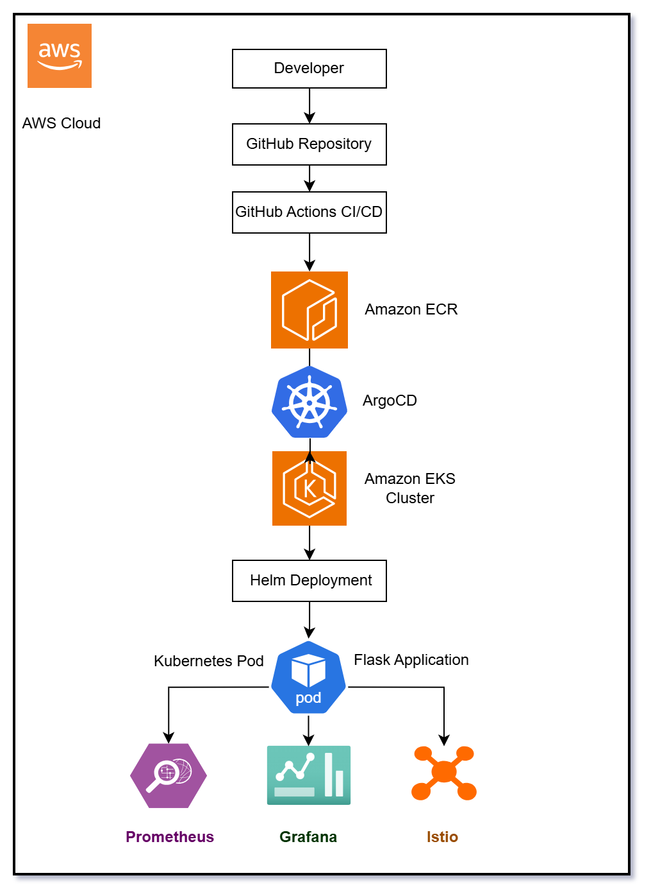
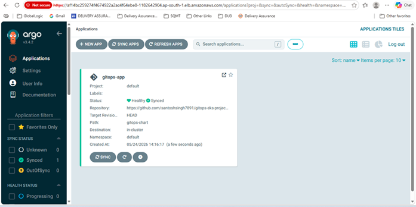
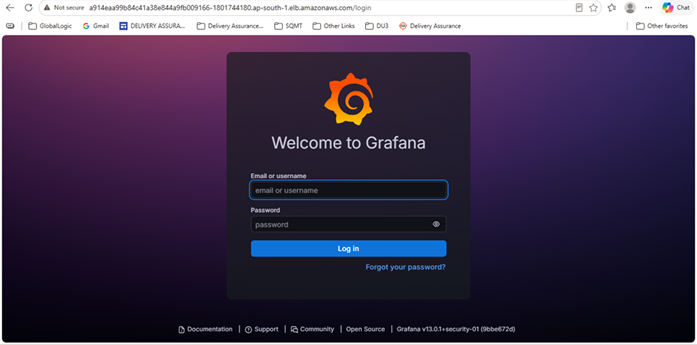
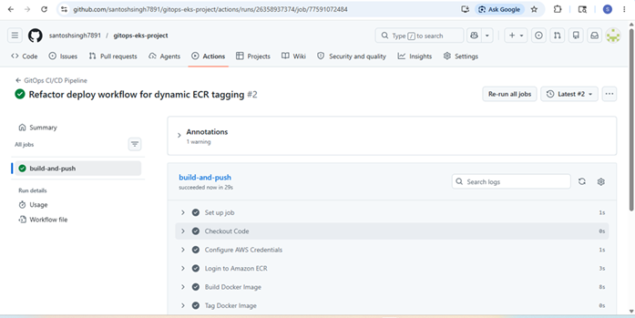
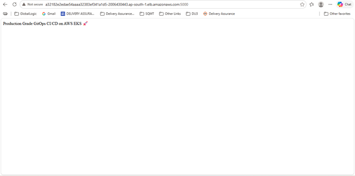
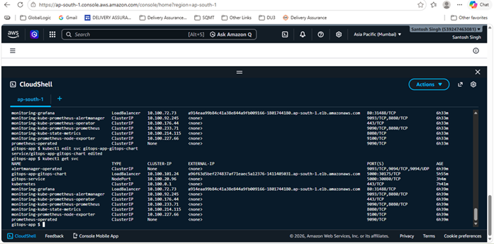
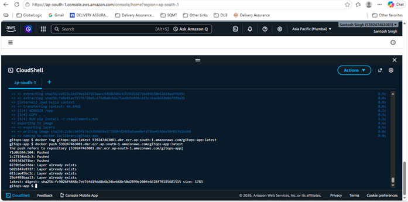

# 🚀 AWS EKS GitOps Project with ArgoCD, Istio, Prometheus & Grafana

## 📌 Project Overview

This project demonstrates a Production-Grade GitOps CI/CD Platform on AWS using:

- AWS EKS
- Docker
- Kubernetes
- Helm
- ArgoCD
- GitHub Actions
- Istio
- Prometheus
- Grafana
- Amazon ECR

The project automates containerized application deployment into Kubernetes using GitOps principles and CI/CD automation.

---

# 🏗️ Architecture Diagram



---

# ⚙️ Technologies Used

| Technology | Purpose |
|---|---|
| AWS EKS | Kubernetes Cluster |
| Docker | Containerization |
| Amazon ECR | Docker Registry |
| GitHub Actions | CI/CD Pipeline |
| ArgoCD | GitOps Deployment |
| Helm | Kubernetes Package Manager |
| Istio | Service Mesh |
| Prometheus | Monitoring |
| Grafana | Visualization |
| Kubernetes | Container Orchestration |

---

# 📂 Project Structure

```bash
.
├── .github/workflows/
│   └── deploy.yml
│
├── gitops-chart/
│   ├── templates/
│   ├── Chart.yaml
│   └── values.yaml
│
├── k8s/
│   ├── deployment.yaml
│   └── service.yaml
│
├── screenshots/
│   ├── architecture-diagram.png
│   ├── argocd-dashboard.png
│   ├── grafana-dashboard.png
│   ├── github-actions-success.png
│   ├── application-running.png
│   ├── eks-cluster.png
│   └── ecr-image-push.png
│
├── Dockerfile
├── app.py
├── requirements.txt
└── README.md
```

---

# 🚀 CI/CD Workflow

1. Developer pushes code to GitHub
2. GitHub Actions triggers CI/CD pipeline
3. Docker image is built automatically
4. Docker image is pushed to Amazon ECR
5. ArgoCD monitors GitHub repository
6. Kubernetes manifests are synced automatically
7. Application gets deployed into AWS EKS Cluster
8. Prometheus collects metrics
9. Grafana visualizes monitoring dashboards

---

# 📸 Project Screenshots

## ArgoCD Dashboard



---

## Grafana Dashboard



---

## GitHub Actions Pipeline



---

## Running Application



---

## Amazon EKS Cluster



---

## Amazon ECR Docker Push



---

# 📊 Monitoring Stack

## Prometheus

Prometheus is used for:

- Kubernetes metrics collection
- Node monitoring
- Pod monitoring
- CPU and Memory utilization tracking
- Cluster health monitoring

---

## Grafana

Grafana dashboards visualize:

- Cluster metrics
- Pod metrics
- Resource utilization
- Node performance
- Application health
- Kubernetes monitoring dashboards

---

# 🌐 Istio Service Mesh

Istio provides:

- Traffic Management
- Service Discovery
- Observability
- Security
- Load Balancing
- Service-to-Service Communication

---

# ☸️ Kubernetes Deployment

The application is deployed into AWS EKS using:

- Kubernetes Deployments
- Kubernetes Services
- Helm Charts
- ArgoCD GitOps synchronization

---

# 📦 Docker Containerization

The Flask application is containerized using Docker and stored inside Amazon ECR.

---

# 🔧 Deployment Commands

## Create EKS Cluster

```bash
eksctl create cluster \
--name gitops-cluster \
--region ap-south-1 \
--nodegroup-name workers \
--node-type t3.medium \
--nodes 2
```

---

## Install ArgoCD

```bash
kubectl create namespace argocd

kubectl apply -n argocd \
-f https://raw.githubusercontent.com/argoproj/argo-cd/stable/manifests/install.yaml
```

---

## Install Monitoring Stack

```bash
helm repo add prometheus-community \
https://prometheus-community.github.io/helm-charts

helm install monitoring \
prometheus-community/kube-prometheus-stack
```

---

## Install Istio

```bash
curl -L https://istio.io/downloadIstio | sh -

istioctl install --set profile=demo -y
```

---

## Build Docker Image

```bash
docker build -t gitops-app .
```

---

## Push Docker Image to Amazon ECR

```bash
docker push <ECR-IMAGE-URL>
```

---

## Deploy Using Helm

```bash
helm install gitops-app ./gitops-chart
```

---

# 📈 Auto Scaling

Horizontal Pod Autoscaler (HPA) is configured using:

```bash
kubectl autoscale deployment gitops-app \
--cpu-percent=70 \
--min=2 \
--max=10
```

---

# ✅ Features

- GitOps-based deployment
- Automated CI/CD pipeline
- Kubernetes orchestration
- Docker containerization
- Helm package deployment
- Monitoring with Prometheus & Grafana
- Service mesh using Istio
- Horizontal Pod Autoscaling
- AWS ECR integration
- Automated Kubernetes deployment
- GitHub Actions automation
- Production-grade AWS deployment

---

# 🔮 Future Enhancements

- Terraform Infrastructure Automation
- AWS Load Balancer Controller
- ExternalDNS Integration
- HTTPS using ACM
- Loki Logging Stack
- Blue/Green Deployment
- Multi-Environment Deployment
- Karpenter Auto Scaling
- Jenkins Integration
- Canary Deployments

---

# 👨‍💻 Author

Santosh Singh

GitHub:
https://github.com/santoshsingh7891

LinkedIn:
https://www.linkedin.com/in/santosh-singh-141a5775/

Repository:
https://github.com/santoshsingh7891/gitops-eks-project

---

# ⭐ If you like this project, don't forget to Star the repository!
